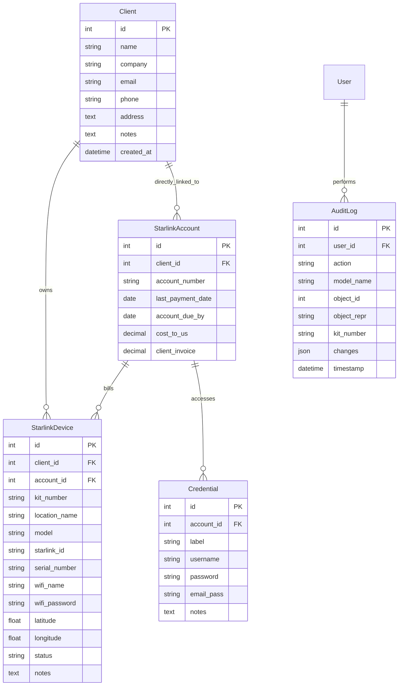

# 🛰️ StarlinkOps Manager

A premium Django-based operational console and billing tracker designed for Managed Service Providers (MSPs), hardware resellers, and logistics teams managing multiple wholesale Starlink subscriptions and deployed hardware terminals.

---

## 📖 Table of Contents
1. [Core Features](#-core-features)
2. [Database Architecture](#-database-architecture)
3. [Technology Stack](#%EF%B8%8F-technology-stack)
4. [Installation & Local Development](#-installation--local-development)
5. [Deployment (cPanel / Phusion Passenger)](#-deployment-cpanel--phusion-passenger)
6. [🔮 Future Product Roadmap](#-future-product-roadmap)

---

## 🌟 Core Features

*   **Interactive Control Console**: Unified dashboard listing active clients, wholesale billing accounts, credentials, and mapped hardware terminals.
*   **Starlink Deployment Map**: Built-in interactive map powered by **Leaflet.js** and **OpenStreetMap** to track physical coordinates of all active dishes with color-coded operational statuses. Includes a GPS picker tool to click and select coordinates on the map.
*   **Wholesale Billing & Margin Tracker**: Automatically aggregates wholesale subscription costs versus retail client invoices to display margins, billing schedules, and advance next due dates with a single click.
*   **Staff Credentials Vault**: Securely links multiple portal or router administrator login credentials (usernames, passwords, recovery emails) to billing accounts, complete with safe one-click clipboard copying.
*   **Real-time Audit Logs**: Auto-tracks database state changes (`CREATE`, `UPDATE`, `DELETE`) with exact field-level diffs showing what was changed (previous vs current values), who did it, and when.

---

## 🗄️ Database Architecture

The data layer models relationships between wholesale accounts, clients, hardware, and access keys:



---

## 🛠️ Technology Stack

*   **Backend**: Python 3.11+ / Django 5.2 (LTS compatibility)
*   **Frontend**: HTML5 / Vanilla CSS3 (Custom Dark-themed dashboard UI) / JavaScript (ES6)
*   **Mapping**: Leaflet.js / OpenStreetMap (utilizing strict-origin referrer policy)
*   **Static Asset Delivery**: WhiteNoise (with file compression and cache-busting manifest storage)
*   **Database**: SQLite (production-ready deployment or scalable local database engine)

---

## 💻 Installation & Local Development

1.  **Clone the Repository**:
    ```bash
    git clone https://github.com/your-username/starlink_manager.git
    cd starlink_manager
    ```

2.  **Set up Virtual Environment**:
    ```bash
    python3 -m venv .venv
    source .venv/bin/activate
    ```

3.  **Install Dependencies**:
    ```bash
    pip install -r requirements.txt
    ```

4.  **Run Database Migrations**:
    ```bash
    python manage.py migrate
    ```

5.  **Seed Sample Data**:
    ```bash
    python seed.py
    ```

6.  **Create a Superuser**:
    ```bash
    python manage.py createsuperuser
    ```

7.  **Run the local server**:
    *   Press `F5` in VS Code (uses the preconfigured [.vscode/launch.json](file:///.vscode/launch.json))
    *   Or execute in your terminal:
        ```bash
        python manage.py runserver
        ```

---

## 🚀 Deployment (cPanel / Phusion Passenger)

The project is preconfigured for cPanel Passenger deployments. 

1.  **Configure environment variables** in the cPanel **Setup Python App** GUI:
    *   `DJANGO_SECRET_KEY`: A secure random secret key.
    *   `DJANGO_DEBUG`: Set to `False`.
    *   `DJANGO_ALLOWED_HOSTS`: Separated by commas, e.g. `ops.yourdomain.com,yourdomain.com`.
2.  **Pull changes & install requirements** on the server environment:
    ```bash
    pip install -r requirements.txt
    ```
3.  **Run migrations & collect static assets**:
    ```bash
    python manage.py migrate
    python manage.py collectstatic --noinput
    ```
4.  **Restart the web application**:
    ```bash
    touch tmp/restart.txt
    ```